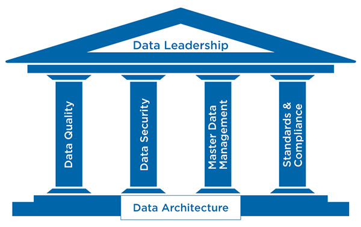

# Data Governance
A set of principles and practices that ensure high quality through the complete lifecycle of your data.

# Data Governance Pillars

# Goals

* Make consistent, confident business decisions based on trustworthy data aligned with all the various purposes for the use of the data assets within the enterprise
* Meet regulatory requirements and avoid fines by documenting the lineage of the data assets and the access controls related to the data
* Improve data security by establishing data ownership and related responsibilities
* Define and verify data distribution policies including the roles and accountabilities of involved internal and external entities
* Use data to increase profits (everybody likes this one). Data monetization starts with having data that is stored, maintained, classified and made accessible in an optimal way.
* Assign data quality responsibilities in order to measure and follow up on data quality KPIs related to the general performance KPIs within the enterprise
* Plan better by not having to cleanse and structure data for each planning purpose
* Eliminate re-work by having data assets that is trusted, standardized and capable of serving multiple purposes
* Optimize staff effectiveness by providing data assets that meet the desired data quality thresholds
* Evaluate and improve by rising the data governance maturity level phase by phase
* Acknowledge gains and build on forward momentum in order to secure stakeholder continuous commitment and a broad organizational support
